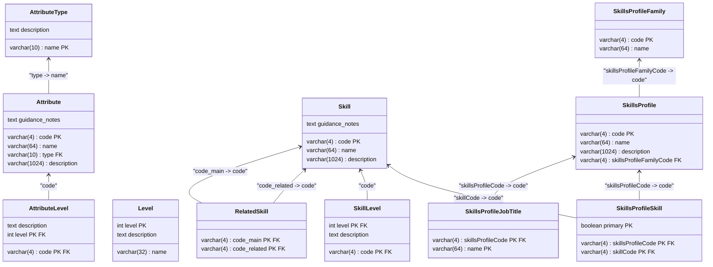

# S.F.I.A. - Skills Framework for the Information Age (supportive services for v9)

_Supportive project for the framework to help me build other related applications and services._

## TL;DR version
> [!NOTE]  
> [SFIA framework](https://sfia-online.org/en/sfia-9) as a platform via downloadable [SQLite database](https://github.com/jankudev/sfia-tools/releases/download/v0.0.1/sfia-sqlite.db) and/or a REST API.

## Motivation

Since 2017 SFIA had
a [change-request #73 accepted to create a platform service](https://sfia-online.org/en/sfia-8/change-requests/sfia-as-a-platform)
around it in order to enable building applications around it's content and help with the adoption into organisations and
enterprises. Although the project had been started, to my knowledge it was never finished and the code was never
released. That's why I started with this pet-project to make the SFIA framework available as a data source and/or API in order to help
the community as I see great value in it (and got frustrated by the lack of it 😅).

### License

SFIA is a non-profit organisation and their licensing policy reflects that as is stated on their website:
> SFIA remains free of charge for most non-commercial use
>
> - The SFIA Foundation is a not-for-profit organisation
> - There is a modest licence fee for large organisations using SFIA and for organisations that use SFIA for commercial purposes
> - The licence fee supports the continued development of the framework and ecosystem support
> - Organisations and individuals who contribute a licence fee can be proud that they are helping the continued development of the industry

For more details please refer to the official [Using and licensing SFIA](https://sfia-online.org/en/about-sfia/licensing-sfia/using-and-licensing-sfia)
page and please respect their licensing policy.

### Disclaimer

This is my personal project and is not affiliated with the SFIA Foundation in any way. The project is not intended to
replace the official SFIA website or any other official SFIA resources.

I'm using this project to learn and experiment with different technologies and practices, so please use it at your own
risk.

#### Support

🚀 Anyways if you find this useful in any way, please let me know and I'll be happy to help you with any questions or
improvements - let's get in touch on [LinkedIN::jankutomas](https://www.linkedin.com/in/jankutomas/).

☕ If you see value in what I've done and would like to support me, you can buy me a coffee at [BuyMeACoffee::jankutomas](https://buymeacoffee.com/jankutomas).

#### TODOs (just notes for myself - possibly move to 'Github - issues' later on)
- [ ] create a MongoDB database, parametrize the scraper to choose SQLite or MongoDB for persistence
- [ ] improve significantly on documentation of generated OpenAPI in `api-service`

## Architecture

The project is split into two independent modules:
- `data-scraper` - responsible for scraping the SFIA website and storing the data in a database
- `api-service` - responsible for providing an API to access the SFIA data

The modules are containerized using Docker and can be built/run independently or together using `docker-compose`.
See descriptions in the `docker` directory.

### Data Scraper (module `data-scraper`)

The scraping tool uses JSoup to sequentially scrape the SFIA website for the relevant content storing it in a SQLite database.

The scraper is designed to be run as a standalone tool. It can be run via `./gradlew :data-scraper:run`. This will scrape the
website and produce an SQLite database file `data-scraper/build/db/sfia-sqlite.db`.

The schema of the database is defined in the `data-scraper/src/kotlin/dev/janku/sfia/persistenceModel/SfiaDbSchema.kt` and
here is a simplified [diagram of the schema](docs/sfia-db-schema-mermaid.md).

The main entities in the database are:
- `Skill` - representing a skill in the SFIA framework as in the [SFIA 9 - skills directory A-Z](https://sfia-online.org/en/sfia-9/all-skills-a-z)
- `SkillLevel` - description of the defined skill levels for each skill, f.e. [SFIA 9 - Programming/Software development (PROG)](https://sfia-online.org/en/sfia-9/skills/programming-software-development)
- `SkillsProfile` - representing an illustrative skills profile (jobs) as proposed in the [SFIA 9 -illustrative skills profiles](https://sfia-online.org/en/tools-and-resources/standard-industry-skills-profiles/sfia-9-skills-for-role-families-job-titles)
- `SkillsProfileSkill` - representing the skills in the illustrative skills profile mapping

Other generic entities somehow separate, but relating indirectly to the individual skills and profiles are:
- `Attribute` - the generic attributes described at [SFIA 9 - generic attributes - directory](https://sfia-online.org/en/sfia-9/generic-attributes-all-skills-a-z)
- `Level` - the generic levels described at [SFIA 9 - levels of responsibility](https://sfia-online.org/en/sfia-9/responsibilities)

> [!IMPORTANT]  
> Instead of using artificial IDs (integers) for primary keys I've decided to use 4-letter codes.
> SFIA itself uses 4-letter codes for skills and generic attributes, so I've decided to use the same for the database entities.
> That way even for sub-sequent changes and repetitive 'scraping' the data and relations in your apps are expected to stay consistent. 

#### Database artefact

So you needn't download, build and run the scraper yourself, I've included the database file as an artefact to this repository.
The DB artefact can be downloaded from the [releases page - v0.0.1 (snapshot 2024-02-05)](https://github.com/jankudev/sfia-tools/releases/tag/v0.0.1).

#### Database ER diagram (included)

#### Arch. decision: Why SQLite?

The SFIA framework data entities relate to each other in a hierarchical way, which makes it a good candidate for a
relational database.

The choice of SQLite was made due to its simplicity and ease of use. It is a serverless database that can be easily used
and embedded into all sorts of applications including mobile apps, it has a very small footprint yet implements a full SQL.

The amount of data in the framework is pretty small and not expected to grow significantly, so another reason why SQLite
is a good choice.

#### Arch. decision: Why JSoup and serial scraping?

JSoup is a Java library for working with real-world HTML. It provides a very convenient API for extracting and
manipulating data, using the simple CSS selectors I can easily get from Chrome WebDevTools
and test directly in the browser console using `$$(selector)`.

We also scrape the web in sequence without parallelism to avoid overloading the SFIA website and to keep the scraping
simple and predictable. It also allows us to easily debug and test the scraping process as we log on `stdout` the whole process.

As the content of SFIA does not change very often and the scraped DB is reusable (as it's expected to be used read-only)
there was no need to optimize the performance.

### API Service (module `api-service`)

The API service is a [Spring Boot](https://spring.io/projects/spring-boot) application that provides a REST API to access the SFIA data stored in the provided SQLite database.
To expose the API we're using the [Spring Data Rest](https://spring.io/projects/spring-data-rest) project and to crate the
OpenAPI v3 documentation we're using the [SpringDoc OpenAPI](https://springdoc.org/) project.

The service exposes the following endpoints to access SFIA data:
- `/skills` - to get a list of all skills
- `/skills/[code]` - to get a single skill by its code including it's levels
- `/skills/[code]/relatedSkills` - the related skills for a given skill
- `/skillsProfiles` - to get a list of all skills profiles
- `/skillsProfiles/[code]` - to get a single skills profile by its code (referencing the resource for associated skills)
- `/skillsProfiles/[code]/primarySkills` - to get the primary skills (first) for a given skills profile
- `/skillsProfiles/[code]/secondarySkills` - to get the secondary (other) skills for a given skills profile
- `/attributes` - the get a list of all attributes
- `/attributes/[code]` - to get a single attribute by its code

> [!IMPORTANT]  
> This API is read-only and does not provide any means to modify the data in the database.
> The available HTTP methods on all endpoints are `GET` and `HEAD` (also the not-so-common `OPTIONS` and `TRACE`).

#### Paging and Sorting

The default [paging provided by Spring Data Rest](https://docs.spring.io/spring-data/rest/reference/paging-and-sorting.html) is used
for convenience with the default page size of 20. The page size can be changed by altering the config files in `api-service/src/resources/config`.

#### Swagger UI (generated documentation)

Since we're using SpringDoc for the OpenAPI documentation extracting metadata from the codebase, the generated
documentation is available at:
- `/docs/api-docs` - OpenAPI v3 JSON document
- `/docs/swagger-ui.html` - the Swagger UI to interact with the API (visualized OpenAPI v3 JSON document)

#### Running the service

The prerequisite to run the service is to have previously generated or obtained the database file `sfia-sqlite.db`.
The service can be run as a standalone service (see and modify the `resources/config/applicayion.yml`) or as a Docker container (see the `docker` directory).

Additionally for development purposes there is the task `./gradlew :api-service:runLocal` to run the service locally. This task
will automatically fetch the database file from the `data-scraper` module and start the service, if the file is not found/available
an exception is throw informing you to run the `./gradlew :data-scraper:run` module task first to scrape and create the database.
The database file for the `runLocal` task is expected to be placed in `api-service/build` directory.

#### Arch. decision: Why Spring Data REST?

Spring Data REST is a project that makes it easy to build hypermedia-driven REST web services on top of Spring Data repositories
following the HATEOAS principle. It exposes the repositories as REST resources and provides a lot of features out-of-the-box.

Also it allowed to easily use the SpringDoc to generate the OpenAPI contract providing additional tools.

As this service is for convenience (and I wanted to try out this tech stack for the purpose of practicing JPA) it's
good enough at this stage of the project.

---

## Generated projectdocumentation

### Build (default Gradle info)

This project uses [Gradle](https://gradle.org/).
To build and run the application, use the *Gradle* tool window by clicking the Gradle icon in the right-hand toolbar,
or run it directly from the terminal:

* Run `./gradlew run` to build and run the application.
* Run `./gradlew build` to only build the application.
* Run `./gradlew check` to run all checks, including tests.
* Run `./gradlew clean` to clean all build outputs.

Note the usage of the Gradle Wrapper (`./gradlew`).
This is the suggested way to use Gradle in production projects.

[Learn more about the Gradle Wrapper](https://docs.gradle.org/current/userguide/gradle_wrapper.html).

[Learn more about Gradle tasks](https://docs.gradle.org/current/userguide/command_line_interface.html#common_tasks).

This project follows the suggested multi-module setup and consists of the `data-scraper` and `api-service`.
The shared build logic was extracted to a convention plugin located in `buildSrc`.

This project uses a version catalog (see `gradle/libs.versions.toml`) to declare and version dependencies
and both a build cache and a configuration cache (see `gradle.properties`).

### Deployment (default Docker info)

The application is containerized using Docker. The docker-compose configuration file and each modules dockerfiles
are located in the `docker` directory in the root of the project.